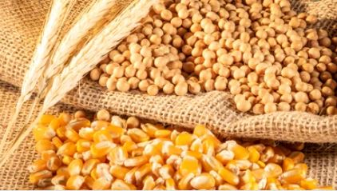

# Project 1: Crop Yields and Weather 

## The Hypothesis Statement

Crop yields are driven by weather variables such as temperature and precipitation during summer months.
 
We looked at crop yields of soybeans, corn and wheat for five U.S. states--Missouri, Kansas, Illinois, Iowa and Texas--for a span of 20 years. 

Compared the difference between the state’s average temperature and its effect on yield and the average precipitation and its effect on the amount of yield.
 
We also looked at different counties,within a state, to see how different weather patterns across a state affects the crop’s yield.

## The Questions Asked

1. What temperature produces the highest yield for our crops?
2. At what perception will the crop yield the most?
3.  What states tend to have better temperature / precipitation for the best yield of crops?
4. What does the crop growth look like with higher/lower precipitation/weather?

## The Data

We gathered precipitation and temperature data for counties in five states (Missouri, Illinois, Kansas, Texas and  Iowa) from National Centers for Environmental Information - National Oceanic and Atmospheric Administration: https://www.ncdc.noaa.gov/data-access

We pulled annual crop yield data by county for three crops (corn, soybeans, wheat) from United States Department of Agriculture - National Agricultural Statistics Service - Quick Stats:   https://quickstats.nass.usda.gov/

## The Summary

1. What temperature produces the highest yield for our crops?
   - 85℉ 
2. At what precipitation will the crop yield the most?
   - Around the 5 inch mark is when crops yielded the most 
3.  What states tend to have better temperature / precipitation for the best yield of crops?
    - Missouri had the highest correlation of weather data and  crop yields
4. What does the crop growth look like with higher/lower precipitation/weather?
   - Precipitation of 1 to 7.5 inches tends to correlate to higher crop growth; Precipitation rates over 8 inches, and under 1 inch, led to the    
     least amount of growth.  
   - The average maximum temperature range between 75℉  and 90℉  tended to yield the majority amount of crops; While the average maximum  
     temperatures of >90℉ and <75℉ yield the least amount of crops.  

## The Conclusion

There was little correlation between the weather data we analyzed and crop yields, as most of the regressions had an r-squared values ranging from 2%-4%.

Some of the reasons for this could be, not well enough aligned weather data time period to crop development, using max temp vs average, inability to control for different soil types or farming techniques, use of different seed types or equipment.

We do not have enough of a relationship to use this data to forecast crop yields based on weather and would need to do further analysis.
