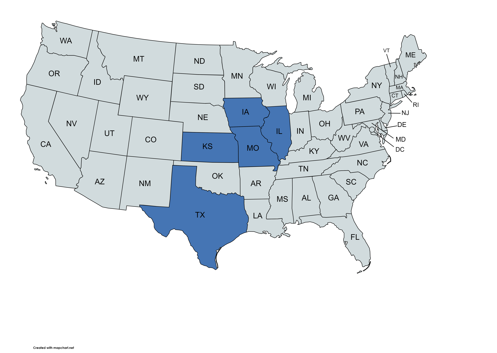

# Project 1: Crop Yields and Weather 

## The Hypothesis Statement

Crop yields are driven by weather variables such as temperature and precipitation during summer months.
 
We looked at crop yields of soybeans, corn and wheat for five U.S. states--Missouri, Kansas, Illinois, Iowa and Texas--for a span of 20 years. 

Compared the difference between the state’s average temperature and its effect on yield and the average precipitation and its effect on the amount of yield.
 
We also looked at different counties,within a state, to see how different weather patterns across a state affects the crop’s yield.

